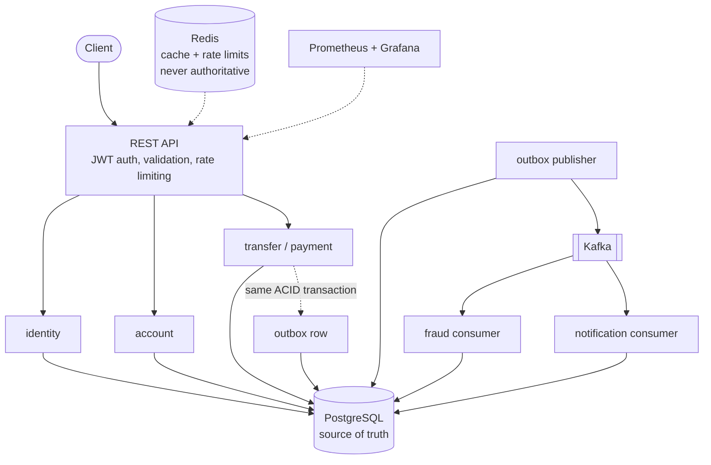

# LedgerFlow

A distributed payment and double-entry ledger platform where PostgreSQL is
the transactional source of truth, built to survive concurrency, dependency
outages and a skeptical code review.

## Architecture



One deployable, strict internal boundaries (a modular monolith by
decision, [ADR-009](docs/decisions/ADR-009-modular-monolith.md)). The money
path is a single database transaction: validate, claim idempotency key,
lock balance rows in sorted order, write transaction + balanced ledger
entries + balance updates + audit row + outbox row, commit.

## Key engineering problems solved

- **Double spending**: pessimistic row locks in deterministic order, with a
  database CHECK constraint as the last line of defense. Proven by 1,000
  concurrent transfers over one balance: exactly the affordable half
  succeed, the books stay exact.
- **Double-entry integrity**: every transaction's ledger entries must sum
  to zero, enforced by a deferred constraint trigger IN the database. An
  unbalanced commit is impossible, not just unlikely.
- **Idempotency**: key claim, operation and response snapshot commit in one
  transaction. Concurrent duplicates block on the unique index and replay
  the stored response. Survives restarts because the state is in Postgres.
- **Event consistency**: transactional outbox to Kafka, at-least-once with
  deduplicating consumers, dead-letter topics, and a broker outage test
  that pauses Kafka mid-payment.
- **Deadlocks**: reproduced on purpose, detected by PostgreSQL, recovered
  by retry; made impossible between movements by sorted lock order.
- **Performance**: measured, never invented. EXPLAIN ANALYZE before/after
  for every index, OFFSET vs keyset at depth 500k, partition pruning.

## Technology

| Layer | Choice |
|---|---|
| Backend | Java 21, Spring Boot 3.5, hand-written SQL via JdbcClient |
| Database | PostgreSQL 17, Flyway migrations, monthly partitioning |
| Messaging | Kafka (KRaft), transactional outbox, DLT |
| Cache | Redis (cache-aside + rate limiting, fail-open) |
| Observability | Micrometer, Prometheus, Grafana, OTel tracing, ECS JSON logs |
| Tests | JUnit 5, Testcontainers (Postgres, Kafka, Redis), k6 |
| Deploy | Docker, Helm on kind (real), Terraform for AWS (reference) |

## Database engineering

Schema, ER diagram and invariants: [docs/database-design.md](docs/database-design.md).
Measured query work: [docs/query-optimization.md](docs/query-optimization.md), highlights on the
5M transaction / 9.6M ledger entry dev dataset:

| Case | Before | After |
|---|---|---|
| Account statement page | 403.5 ms (121k pages read) | 0.48 ms (60 pages) |
| Wallet history | 201.4 ms | 14.9 ms |
| Page at depth 500,000 | OFFSET: 421 ms | keyset: 0.86 ms |
| One-month aggregate | all partitions: 277 ms | pruned: 44 ms |

Advanced SQL showcase (window functions, CTEs, FILTER aggregates):
[docs/sql/](docs/sql/).

## Performance (real runs, laptop honesty included)

k6, 53 VUs, 5 concurrent scenarios, 60s: **44,375 requests, 688 req/s,
zero failures.** Transfers p95 103ms, hot-wallet contention p95 105ms,
payments p95 137ms. Details and caveats: [docs/performance.md](docs/performance.md).

## Reliability

Chaos test: 120s of transfers while Kafka is stopped and Redis is paused.
102,110 requests, zero failures, ledger sum exactly zero afterwards, outbox
drained. The first run found two real bugs (60s Lettuce timeout, outbox
publisher throughput) that were fixed and re-measured.
[docs/failure-handling.md](docs/failure-handling.md).

A column rename was executed live with zero failed requests during the
migration: [docs/zero-downtime-migration.md](docs/zero-downtime-migration.md).

## Observability

Prometheus + Grafana provisioned from the repo (`docker compose up`),
domain metrics (movements, outbox lag, cache ratio, deadlock retries),
traces with ids in every log line: [docs/observability.md](docs/observability.md).

## API

OpenAPI at `/v3/api-docs`, Swagger UI at `/swagger-ui.html`. Money
endpoints require an `Idempotency-Key` header. Errors share one shape with
stable codes and correlation ids.

## Local development

```bash
export JAVA_HOME="$(brew --prefix openjdk@21)/libexec/openjdk.jdk/Contents/Home"

docker compose up -d          # Postgres :55432, Kafka :9092, Redis :6379,
                              # Prometheus :9090, Grafana :3000
mvn verify                    # unit + integration tests (Testcontainers)
mvn spring-boot:run           # Flyway migrates on boot; app on :8080

# optional: 5M transaction dataset for query work
docker exec -i ledgerflow-postgres psql -U ledgerflow -d ledgerflow \
    -f - < scripts/seed-dev-data.sql
```

Docker Engine 29 note: Testcontainers 1.x needs
`src/test/resources/docker-java.properties` with `api.version=1.44`
(already in the repo).

## Deployment

Real target (zero cost): a local kind cluster via
`./deploy/kind/deploy-kind.sh` (builds the image, installs the Helm chart
with probes/HPA/secrets, smoke tests health). The AWS production shape
(EKS, Multi-AZ RDS, ElastiCache, MSK) exists as validate-clean Terraform in
[deploy/terraform/aws](deploy/terraform/aws), deliberately never applied;
that is documented, not hidden.

## Engineering decisions

Nine ADRs in [docs/decisions/](docs/decisions/): source of truth, outbox,
Kafka, Redis boundaries, isolation level, concurrency control, pagination,
partitioning, modular monolith. Scaling story: [docs/scalability.md](docs/scalability.md).

## Lessons learned

- Partition bounds are session-timezone sensitive: two clients created
  misaligned monthly partitions with a 7-hour insert-rejecting gap between
  them. Bounds are now explicit UTC instants.
- Fail-open is only as fast as the client timeout in front of it: chaos
  testing caught 25s hangs behind Lettuce's 60s default.
- Throughput claims need measuring: the outbox publisher's default batch
  size fell 65k events behind a burst the first time it was pushed.
- The database is the best code reviewer: the zero-sum trigger and balance
  CHECK caught every mistake the tests threw at them.
