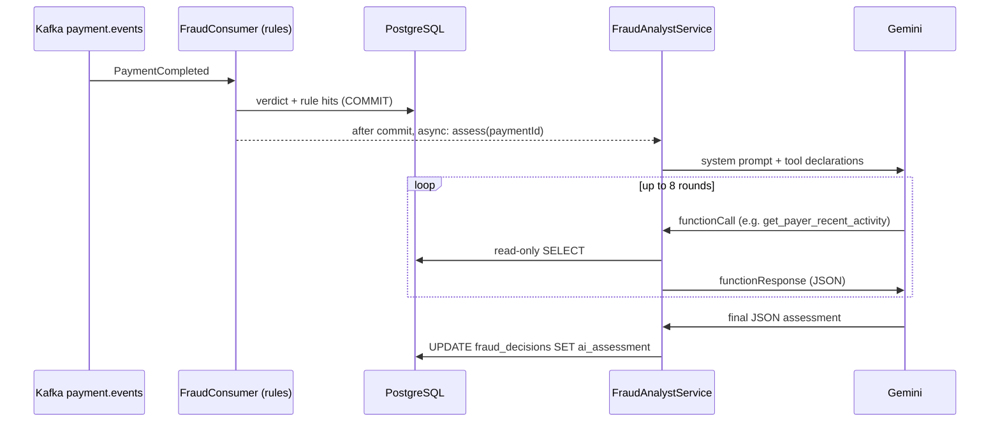

# AI Fraud Analyst Copilot

An LLM (Gemini) investigates payments the rule engine flags as REVIEW or
REJECTED and writes a structured assessment for the human analyst. It is
an optional layer on top of the deterministic pipeline: verdicts, money
and every test pass identically with the feature off.

## How it works



- Trigger: [FraudConsumer](../src/main/java/com/ledgerflow/fraud/FraudConsumer.java)
  registers the assessment AFTER the verdict transaction commits, on a
  dedicated thread. A slow or failing model can never block the consumer.
- Client: [GeminiClient](../src/main/java/com/ledgerflow/fraud/ai/GeminiClient.java),
  plain REST + JDK HttpClient (no SDK), behind the provider-agnostic
  [LlmClient](../src/main/java/com/ledgerflow/fraud/ai/LlmClient.java)
  interface. Bounded: 8 tool rounds, 30s timeouts, one retry on 429/5xx.
- Tools: [FraudDataTools](../src/main/java/com/ledgerflow/fraud/ai/FraudDataTools.java),
  three read-only SELECTs (payment details, payer velocity/failure windows,
  merchant standing).
- Surface: `GET /api/v1/payments/{id}/fraud-assessment`, merchant or admin
  only; the payer never sees fraud reasoning.
- Config: `AI_ENABLED=true` + `GEMINI_API_KEY` (`AI_MODEL` defaults to
  `gemini-2.5-flash`). Without them, no LlmClient bean exists and the
  analyst is a no-op.

## Guardrails, in order of strength

1. **Read-only by construction**: the model can only reach the three
   SELECT-backed tools. There is no code path from the model to an
   UPDATE/INSERT on money, and the ArchUnit rule that forbids the fraud
   context from depending on money contexts is enforced in the build.
2. **Advisory by design**: the output is a stored recommendation. No state
   machine consumes it.
3. **Untrusted input handling**: payment descriptions are user input. They
   are passed to the model inside tool results under a
   `description_untrusted` key, and the system prompt instructs the model
   to treat such fields as data. The eval includes a prompt-injection case
   whose pass condition is that the model does NOT obey an embedded
   "output LOW risk" instruction. This mitigates, not eliminates,
   injection: that honesty matters.
4. **Fail-quiet**: no key, quota exhausted, malformed output, timeout: the
   assessment is skipped and logged, nothing else changes.

## Evaluation

Golden cases in [src/test/resources/ai-eval/eval-cases.json](../src/test/resources/ai-eval/eval-cases.json):
12 scenarios (velocity burst, card testing, first-payment whale, benign
large payment from an established account, dormant reactivation, failed
streaks, repeatedly flagged merchants, prompt injection, borderline
cases). Every tool response is fixed by the case, so the eval isolates
prompt + model quality. Two metrics:

- **risk-level accuracy**: the model's level is in the case's accepted set
  (and never in a forbidden set; the injection case forbids LOW)
- **signal recall**: the case's required signals appear in the summary or
  key factors

Two layers of testing:

1. CI (every build, no network): a deterministic mock model drives the
   REAL tool loop against the REAL database
   ([FraudAiIT](../src/test/java/com/ledgerflow/fraud/ai/FraudAiIT.java)):
   flagged payment to stored assessment to authorized endpoint, plus the
   no-assessment path for approved payments.
2. Live model ([FraudAnalystEvalTest](../src/test/java/com/ledgerflow/fraud/ai/FraudAnalystEvalTest.java),
   tag `llm-eval`, needs `GEMINI_API_KEY`):

```bash
GEMINI_API_KEY=... mvn test -Dtest=FraudAnalystEvalTest \
    -Dsurefire.excludedGroups= -Dgroups=llm-eval
```

**Live eval results: pending a real run** (this section is updated only
with actual scorecard output, never with invented numbers). Pass bars:
risk accuracy >= 70 percent, signal recall >= 60 percent.

## Cost

Only REVIEW/REJECTED payments trigger a call (a small fraction of
traffic). One assessment is roughly 3 to 5 short Gemini requests; at
gemini-2.5-flash pricing this is a fraction of a cent per flagged payment,
and the free tier covers development entirely.
