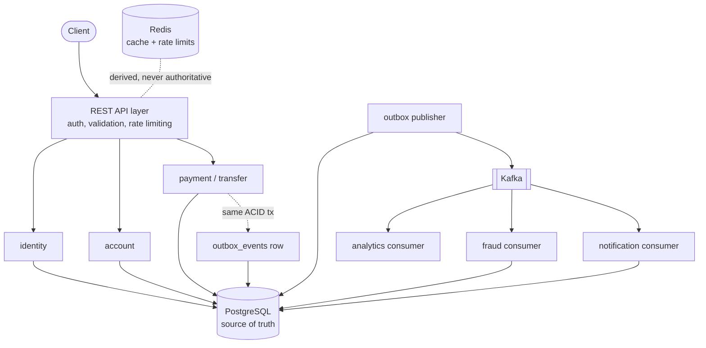

# Architecture

> Status: living document. Sections marked *(planned)* describe phases not yet
> implemented; nothing here claims to exist before it is built and verified.

## Shape: a modular monolith with real boundaries

LedgerFlow is one deployable Spring Boot application with strictly separated
bounded contexts, not a fleet of microservices. This is a deliberate choice:

- The core financial operation (transfer/payment) is **one ACID transaction**
  touching balances, ledger, audit and outbox. Splitting those across services
  would trade a database transaction for a distributed saga: enormous
  complexity for zero benefit at this scale.
- The contexts that *do* benefit from independence (fraud, notifications,
  analytics) are **already asynchronous**: they consume Kafka events and never
  join the financial transaction. Extracting them later is a packaging
  exercise, not a redesign.
- Boundaries are enforced mechanically with ArchUnit tests *(planned, Phase 3)*:
  a context may depend on `common` and on other contexts' published API/events
  only, never on their internals.



## Bounded contexts

| Context | Responsibility | Talks to |
|---|---|---|
| `identity` | users, credentials, JWT, RBAC | PostgreSQL |
| `account` | accounts, balances (read side) | PostgreSQL, Redis (cache) |
| `transfer`/`payment` | money movement: the ACID write path | PostgreSQL (+outbox row) |
| `ledger` | double-entry postings, invariants, reconciliation | PostgreSQL |
| `transactionquery` | history, search, keyset pagination | PostgreSQL, Redis (cache) |
| `outbox` | poll pending events, publish to Kafka | PostgreSQL → Kafka |
| `fraud` | async rule evaluation of payment events | Kafka → PostgreSQL |
| `notification` | async user notifications | Kafka → PostgreSQL |
| `analytics` | async aggregates / reporting views | Kafka → PostgreSQL |
| `common` | error model, correlation IDs, UUIDv7, audit | (none) |

## Source-of-truth rules (non-negotiable)

1. A financial operation is **committed in PostgreSQL or it did not happen**.
   No API response claims success before commit.
2. Kafka carries *facts about committed state* (via the transactional outbox),
   never intent that could diverge from the database.
3. Redis holds *rebuildable projections* (caches, rate-limit counters). Redis
   loss degrades latency, never correctness.
4. The fraud service can flag and hold, but only through its own tables and
   documented state transitions. It cannot mutate ledger history.

## Technology

| Concern | Choice | Why |
|---|---|---|
| Language/runtime | Java 21, Spring Boot 3.5 | virtual-thread-era JVM, mature transaction management |
| Persistence | Spring `JdbcClient`, hand-written SQL | SQL control is a goal of the project; no ORM hiding plans |
| Migrations | Flyway | versioned, reviewable schema evolution |
| Messaging | Kafka *(Phase 5)* | replayable event log for async consumers |
| Cache | Redis *(Phase 6)* | cache + rate limiting, explicitly non-authoritative |
| Observability | OTel + Prometheus + Grafana *(Phase 7)* | traces across HTTP→JDBC→Kafka |
| Tests | JUnit 5 + Testcontainers | invariants proven against real PostgreSQL, not H2 |

## Build & run (Phase 1)

```bash
export JAVA_HOME="$(brew --prefix openjdk@21)/libexec/openjdk.jdk/Contents/Home"
docker compose up -d postgres        # PostgreSQL 17 on localhost:55432
mvn verify                            # unit + Testcontainers integration tests
mvn spring-boot:run                   # app on :8080, Flyway migrates on boot
curl localhost:8080/actuator/health
```

Port note: host port **55432** is used on purpose. Many dev machines
(including the one this was built on) already run a PostgreSQL on 5432, and a
payments platform should never risk pointing at the wrong database.
