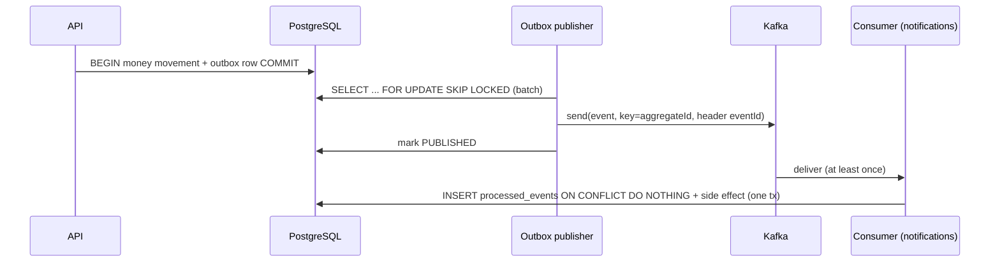

# Distributed Systems: Events, Outbox, Delivery

## The consistency problem the outbox solves

A payment must (a) commit in PostgreSQL and (b) announce itself to other
systems (fraud, notifications, analytics). Doing both directly:

```
BEGIN; UPDATE balances...; INSERT payment...; COMMIT;
kafka.send(PaymentCompleted)        <- crash here: money moved, no event
```

or worse, sending before commit: event announces a payment that then rolls
back. Two systems cannot be updated atomically without a coordinator.

The transactional outbox removes the second system from the transaction:
the event is written as a ROW in the same database transaction as the money
([OutboxWriter](../src/main/java/com/ledgerflow/outbox/OutboxWriter.java)).
The commit either persists both or neither. A separate publisher
([OutboxPublisher](../src/main/java/com/ledgerflow/outbox/OutboxPublisher.java))
polls PENDING rows and moves them to Kafka afterwards.



## Delivery semantics: at-least-once, stated honestly

The publisher sends before marking PUBLISHED. A crash between the two
republishes the event on the next poll. So consumers see at-least-once
delivery, and every consumer dedupes on the `eventId` header via
`processed_events` (`INSERT ... ON CONFLICT DO NOTHING`) inside the same
database transaction as its side effect: marked-processed and
side-effect-applied commit atomically.

Exactly-once is NOT claimed. Kafka's transactional producer could narrow
the window but cannot make the Kafka send and the PostgreSQL update one
atomic operation; dedup at the consumer is required regardless, so the
simpler producer is the better trade.

Ordering: events are keyed by aggregate id, so one aggregate's events stay
in one partition and arrive in order. No global ordering is assumed by any
consumer.

## Failure handling

| Failure | Behavior | Proof |
|---|---|---|
| Kafka down during payment | API unaffected: the outbox row commits with the money; the payer sees success | `kafkaOutagePaymentStillSucceedsAndOutboxDrainsAfterRecovery` in [OutboxKafkaIT](../src/test/java/com/ledgerflow/outbox/OutboxKafkaIT.java) pauses the broker container mid-test |
| Kafka still down at publish time | Row stays PENDING, per-row exponential backoff (1s..60s), attempt counter climbs | same test asserts PENDING + attempts >= 1 during the outage |
| Kafka recovers | Poller drains the backlog; consumer catches up; exactly one side effect | same test |
| Send keeps failing (10 attempts) | Row parked as FAILED: the outbox's dead-letter state, operator-requeueable, never silently dropped | publisher unit behavior |
| Consumer throws on a message | 3 retries 1s apart, then the record goes to `<topic>.DLT` with error headers; the partition unblocks | `poisonMessageLandsOnDeadLetterTopic` |
| Redelivered event | `processed_events` conflict, side effect skipped | `duplicateDeliveryDoesNotDuplicateSideEffects` |
| App crash between send and mark | Event republished next poll; consumers dedupe | by construction (documented at-least-once) |

## Why polling instead of CDC (Debezium)

Log-based change data capture is the higher-throughput answer, but it adds
a Kafka Connect cluster, connector lifecycle management, and replication
slot operations. At this system's scale a 500ms poll with `SKIP LOCKED`
batching is simpler, has no extra infrastructure, and the pattern (rows in
the same transaction) is identical, so swapping the transport for Debezium
later changes no producer or consumer code. The poll interval bounds added
latency at ~0.5s, acceptable for fraud/notification/analytics workloads.

## Multiple instances

`FOR UPDATE SKIP LOCKED` makes concurrent publishers safe: two instances
never hold the same row, and neither queues behind the other. Consumers
scale by Kafka consumer group semantics (6 partitions per topic).
